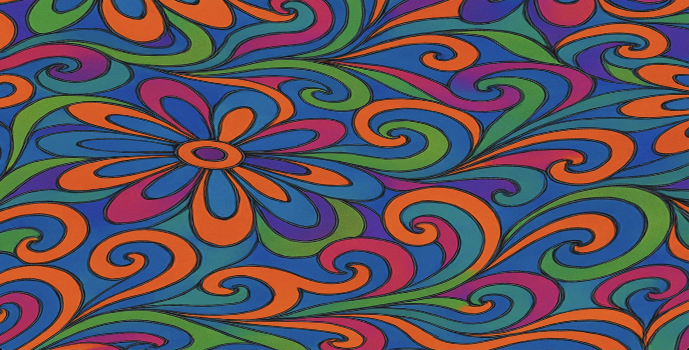

# Lucidia

Lucidia is a browser-based WebGL visualizer coded by ChatGPT and Alana Balagot, inspired by [Ryan Geiss's Drempels software](https://www.geisswerks.com/drempels/).

Play with it here: https://alana314.github.io/lucidia/